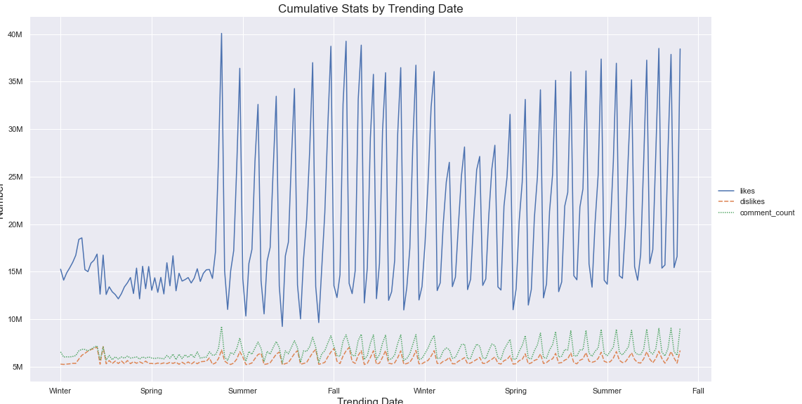

# Youtube-DataMining
Areas: **Text Summarization**, **Tag Suggestion** and **Data Analytics**.

What features matter the most when it comes to YouTube videos? In this project, I will dive in the details of trending youtube videos metadata to see from an analytical view the statistics of the top videos out there.
Also, I performed 
* **text summarization for title suggestion** - judging by the description
* **tag suggestion** - judging by the title and description

#### Interesting Things for exploration
- Most Popular/Non-Popular tags.
- Number of tags comparative to popularity and how do they increase the videos outreach - if they even do.
- How CAPITAL letters affect the title outreach, and in which categories is this technique used.
- Does always more popular mean more likeable?
- Chronological analysis of viewings + ratings + comments (maybe get some events involved - Christmas, Summer, New Years day etc.)
- **Sequence Models** on Title + Description to Tags, in order to build a tag recommendation algorithm
- **Sequence Models** on Tags + Description + Category to Title, in order to provide title recommendation algorithm. These videos are popular videos, meaning they have appealing titles. Let's build a system, that judging by content, can provide the most appropriate title.

### Visualizations

#### Tableau Storytelling
<a href='https://public.tableau.com/views/YoutubeStats_15898015327120/Story1'>Story 1 Link</a>
